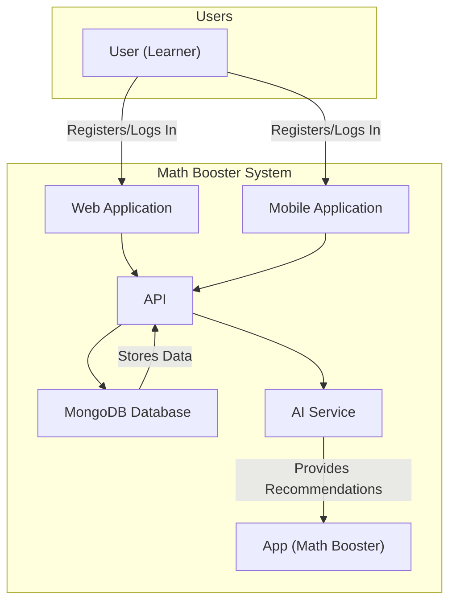
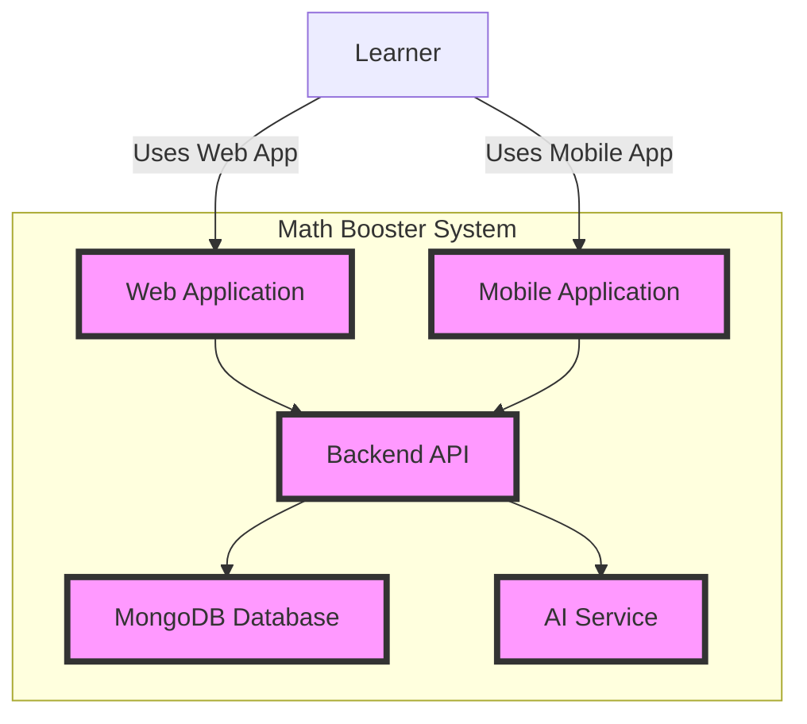
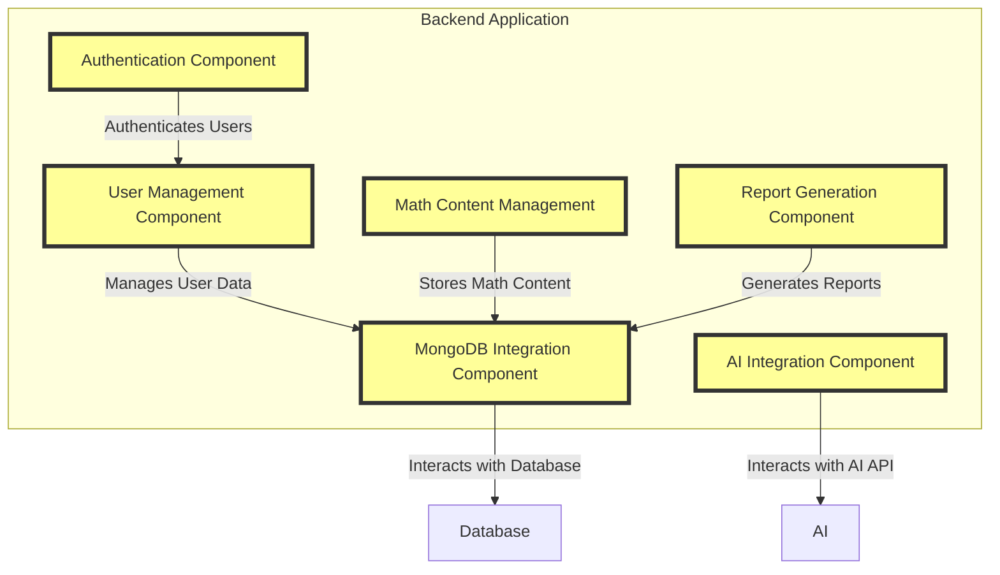

# Math Booster System Diagrams

## Diagram Explanation

### Context Diagram (C1)
Shows how the Math Booster system interacts with users (learners) and external systems like the Web Application, Mobile Application, Database, and AI Service.

### Container Diagram (C2)
Breaks down the system into high-level containers such as the Web App, Mobile App, API, Database, and AI. Learners interact with either the Web or Mobile App to register and log in, while the API manages data flow and interacts with the Database and AI.

### Component Diagram (C3)
Provides a deeper breakdown of the backend system's components:
- Authentication
- User Management
- Math Content Management
- AI Integration
- Report Generation
- MongoDB Integration

### Code Diagram (C4)
Describes authentication and user management functionality, including:
- User authentication via `AuthController`, `AuthService`, and `AuthMiddleware`
- User profile management via `UserController`, `UserService`, and `UserModel`
- AI interactions via `AIController`, `AIService`, and `AIModel`
- MongoDB schema definitions for user data, math content, and reports

## Context Diagram (C1)


## Container Diagram (C2)


## Component Diagram (C3)


## Code Diagram (C4)
```mermaid
classDiagram
    class AuthController {
        +login()
        +register()
    }
    class AuthService {
        +validateCredentials()
        +generateToken()
    }
    class AuthMiddleware {
        +checkToken()
    }
    class UserController {
        +getUserProfile()
        +updateUserProfile()
    }
    class UserService {
        +getUserData()
        +updateUserData()
    }
    class UserModel {
        +_id
        +email
        +name
        +passwordHash
    }
    class AIController {
        +requestRecommendation()
        +receiveAIResponse()
    }
    class AIService {
        +callAIAPI()
        +processAIResponse()
    }
    class AIModel {
        +responseType
        +recommendationData
    }
    class MongoDBModel {
        +userSchema()
        +mathContentSchema()
        +reportSchema()
    }

    AuthController --> AuthService
    AuthService --> AuthMiddleware
    UserController --> UserService
    UserService --> UserModel
    AIController --> AIService
    AIService --> AIModel
    MongoDBModel --> UserModel
    MongoDBModel --> MathContentModel
    MongoDBModel --> ReportModel
